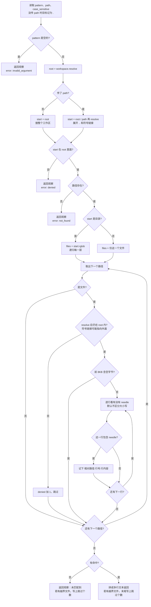

# grep 的查找流程

`grep(env, arguments)` 在 `env.workspace` 里找一段文本。命中时返回相对路径、行号和该行内容，例如 `hello.py:1:VALUE = 42`。失败时返回一条观察。

```mermaid
flowchart TD
    args["读取 pattern、path、case_sensitive<br/>没传 path 时目标记为 ."] --> empty{"pattern 是空的?"}
    empty -->|是| bad["返回观察<br/>error: invalid_argument"]
    empty -->|否| root["root = workspace.resolve"]
    root --> choose{"传了 path?"}
    choose -->|否| whole["start = root<br/>搜整个工作区"]
    choose -->|是| joined["start = root / path 再 resolve<br/>展开 .. 和符号链接"]
    whole --> inside{"start 在 root 里面?"}
    joined --> inside
    inside -->|否| denied["返回观察<br/>error: denied"]
    inside -->|是| exists{"路径存在?"}
    exists -->|否| missing["返回观察<br/>error: not_found"]
    exists -->|是| kind{"start 是目录?"}
    kind -->|是| walk["files = start.rglob<br/>递归每一层"]
    kind -->|否| one["files = 仅这一个文件"]
    walk --> file["取出下一个路径"]
    one --> file
    file --> isfile{"是文件?"}
    isfile -->|否| more{"还有下一个路径?"}
    isfile -->|是| escape{"resolve 后仍在 root 内?<br/>符号链接可能指向外面"}
    escape -->|否| count["denied 加 1，跳过"]
    count --> more
    escape -->|是| binary{"前 8KB 含空字节?"}
    binary -->|是| more
    binary -->|否| line["逐行看有没有 needle<br/>默认不区分大小写"]
    line --> hit{"这一行包含 needle?"}
    hit -->|是| save["记下 相对路径:行号:行内容"]
    save --> nextline{"还有下一行?"}
    hit -->|否| nextline
    nextline -->|是| line
    nextline -->|否| more
    more -->|是| file
    more -->|否| found{"有命中?"}
    found -->|否| none["返回观察：未匹配到<br/>若有越界文件，写上跳过个数"]
    found -->|是| text["拼成多行文本返回<br/>若有越界文件，末尾写上跳过个数"]
```
